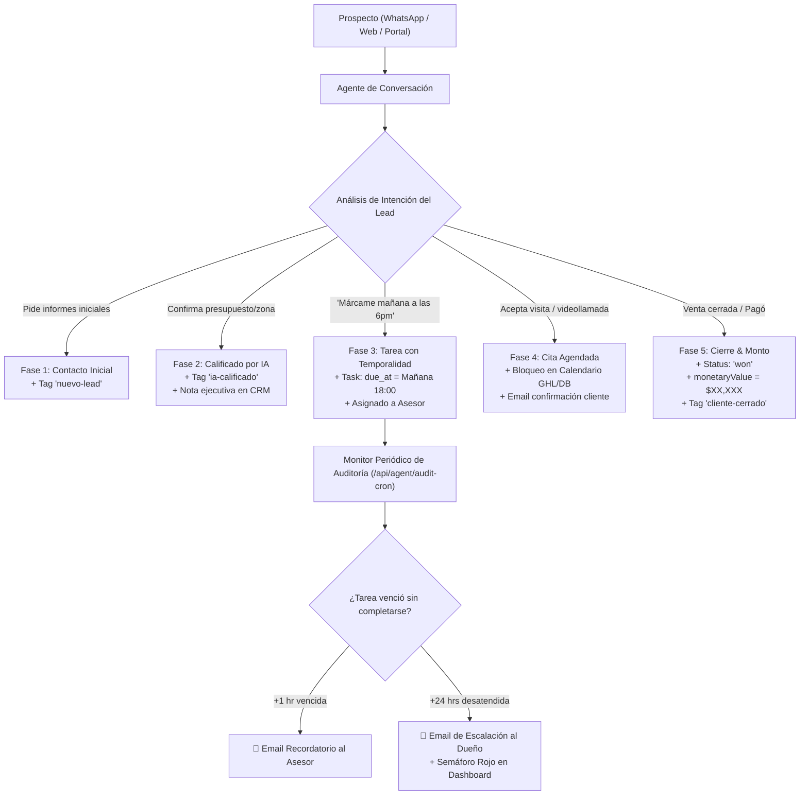

# 🏛️ Arquitectura y Funcionalidad del Pipeline & Accountability Agent

**Sistema:** CRM Agéntico / Lead-Suite  
**Fecha:** Septiembre 2026  
**Versión:** 1.0 (Producción / Multi-Tenant)  

---

## 1. Propósito y Flujo de Trabajo

### 🎯 Propósito Principal
Resolver el problema crítico del **factor humano en ventas**:
1. Los vendedores **no actualizan los estados del CRM ni mueven las tarjetas del Kanban**.
2. Cuando se cierra una venta, los vendedores no registran el monto cobrado porque ya cumplieron su objetivo personal.
3. El dueño del negocio ve un CRM con "0 ventas" y culpa erróneamente al sistema o a la IA.

El **Pipeline Agent** transforma el CRM de un formulario pasivo a un **agente activo y fiscalizador** que:
- Mueve a los prospectos de etapa de forma 100% autónoma según el contexto de las conversaciones.
- Crea tareas con fecha y hora exacta (`due_at`) asignadas a los asesores.
- Fiscaliza el cumplimiento humano mediante un cron de auditoría.
- Alerta por correo al vendedor tras $N$ horas de omisión y escala la alerta en rojo al dueño del negocio con el monto de dinero en riesgo.
- Registra cada acción en una bitácora inmutable (`agent_audit_log`) para blindar al desarrollador y al sistema.

---

### 🔄 Flujos de Trabajo Clave (Workflows)



#### Flujo A: Calificación y Avance Autónomo de Etapa
* **Entrada:** El prospecto dialoga con el agente de chat.
* **Detección:** Cuando el lead indica su presupuesto, zona o interés concreto, el bot dispara la acción `stage.move`.
* **Ejecución:** Se actualiza `opportunities.stage_id` en PostgreSQL local y se sincroniza en GoHighLevel con la etapa correspondiente (`Calificado por IA`), agregando una nota ejecutiva con el resumen de la conversación.

#### Flujo B: Compromiso de Contacto Horario (Tareas con Timestamp)
* **Entrada:** El prospecto dice: *«Ahorita estoy manejando, márcame mañana a las 6:00 PM»*.
* **Detección:** El agente extrae el timestamp exacto (`2026-09-30T18:00:00-06:00`).
* **Ejecución:** Crea una tarea (`task.create`) asignada al asesor con `created_by_agent: true` y `audit_status: 'pending'`, tanto en la BD como en GoHighLevel.

#### Flujo C: Auditoría y Escalación (Accountability)
* **Monitoreo:** El cron job `/api/agent/audit-cron` evalúa tareas pendientes cuyo `due_at` ya expiró.
* **Paso 1 (Recordatorio):** A la hora $N$ de vencimiento (ej. 1 hora después), envía un correo con formato al asesor: *«Tienes una tarea vencida con [Prospecto]»*. La tarea pasa a `audit_status: 'missed'`.
* **Paso 2 (Escalación):** A las $M$ horas sin respuesta (ej. 24 horas), envía un correo de alerta roja al dueño: *«⚠️ Alerta de Omisión: El asesor [Nombre] lleva 24h sin atender al prospecto [Nombre]»*. La tarea pasa a `audit_status: 'escalated'`.

#### Flujo D: Cierre de Venta y Registro de Valor Monetario
* **Entrada:** El asesor o el cliente confirman el pago / apartado.
* **Ejecución:** Se invoca `sale.record` con el monto económico (\$MXN). La oportunidad pasa a estatus `won`, se actualiza el `monetaryValue` en GHL, se añade la etiqueta `cliente-cerrado` y se registra en la bitácora.

---

## 2. Modelo de Datos (PostgreSQL / Supabase)

Todo el modelo es **estrictamente multi-tenant** (scopeado por `account_id`).

### A. Tabla Nueva: `agent_audit_log`
Bitácora inmutable que almacena la evidencia de cada acción del sistema.
```sql
CREATE TABLE agent_audit_log (
  id              UUID PRIMARY KEY DEFAULT gen_random_uuid(),
  account_id      UUID NOT NULL REFERENCES accounts(id) ON DELETE CASCADE,
  contact_id      UUID REFERENCES contacts(id) ON DELETE SET NULL,
  opportunity_id  UUID REFERENCES opportunities(id) ON DELETE SET NULL,
  assigned_user   UUID REFERENCES users(id) ON DELETE SET NULL,
  event_type      TEXT NOT NULL CHECK (event_type IN (
    'stage_moved', 'note_created', 'task_created', 'task_reminder_sent',
    'task_missed', 'task_escalated', 'appointment_created',
    'deal_won', 'deal_lost', 'monetary_updated'
  )),
  detail          JSONB NOT NULL DEFAULT '{}',
  triggered_by    TEXT NOT NULL DEFAULT 'agent' CHECK (triggered_by IN ('agent', 'user', 'system')),
  created_at      TIMESTAMPTZ NOT NULL DEFAULT NOW()
);
```

### B. Modificaciones a Tablas Existentes (Migración 038)
* **`tasks`**:
  * `created_by_agent` (BOOLEAN): Marca si la tarea fue generada por la IA.
  * `ghl_task_id` (TEXT): ID de la tarea en GoHighLevel.
  * `assigned_to` (UUID): Vendedor responsable.
  * `audit_status` (TEXT): `'pending'` | `'completed'` | `'missed'` | `'escalated'`.
  * `missed_at` (TIMESTAMPTZ): Momento en que se detectó el vencimiento.
  * `escalated_at` (TIMESTAMPTZ): Momento en que se escaló al dueño.
  * `reminder_sent_at` (TIMESTAMPTZ): Momento en que se envió el correo al asesor.
* **`notes`**:
  * `created_by_agent` (BOOLEAN): Distingue resúmenes de IA de notas manuales.
  * `ghl_note_id` (TEXT): ID de la nota en GoHighLevel.
* **`appointments`**:
  * `created_by_agent` (BOOLEAN): Cita generada por el agente.
  * `ghl_event_id` (TEXT): ID del evento en el calendario de GHL.
  * `opportunity_id` (UUID): Vinculación con el trato.
* **`accounts`**:
  * `ghl_location_id` (TEXT): Subcuenta de GoHighLevel vinculada.
  * `ghl_api_key` (TEXT): Private Integration Token de GHL.
  * `agent_notify_email` (TEXT): Correo del dueño/administrador para recibir alertas.
  * `agent_email_from` (TEXT): Remitente autorizado para correos del agente.
  * `agent_reminder_hours` (INT, default 1): Horas antes de avisar al asesor.
  * `agent_escalation_hours` (INT, default 24): Horas antes de escalar al dueño.

---

## 3. Endpoints y Componentes de UI Creados

### A. Endpoints de Backend (API Routes)

| Endpoint | Método | Descripción |
|---|---|---|
| **`/api/agent/pipeline-actions`** | `POST` | Ejecutor atómico de acciones: `stage.move`, `task.create`, `note.create`, `appointment.create`, `sale.record`, `tags.add`. Sincroniza en PostgreSQL + GHL y escribe en `agent_audit_log`. |
| **`/api/agent/audit-cron`** | `GET` / `POST` | Job periódico que evalúa tareas vencidas, dispara correos de advertencia al asesor y envía alertas rojas de omisión al dueño. |
| **`/api/agent/audit-stats`** | `GET` | Agregador de métricas en tiempo real: Efectividad de la IA, Semáforo de Asesores (tasa %, omisiones, dinero en limbo) y Feed de auditoría. |

---

### B. Componentes de UI Creados y Modificados

1. **`AgentAccountabilityScorecard.tsx`** (`src/modules/crm/components/`):
   * **Tarjeta de Efectividad IA:** Muestra citas agendadas por la IA, etapas avanzadas autónomamente, tareas asignadas y monto total de ventas auditadas.
   * **Semáforo de Cumplimiento de Asesores:** Tabla con colores por asesor:
     * 🟢 **Verde ($\ge 80\%$):** Asesor al día.
     * 🟡 **Amarillo ($50\% - 79\%$):** Asesor con advertencias.
     * 🔴 **Rojo ($< 50\%$):** Asesor en omisión crítica con alertas escaladas y dinero en riesgo.
   * **Feed en Vivo:** Historial cronológico de las últimas acciones registradas en `agent_audit_log`.

2. **`Dashboard.tsx`** (`src/modules/crm/views/`):
   * Se agregó la pestaña **`🤖 Auditoría & IA`** dentro del bloque de Análisis Operativo para renderizar el `AgentAccountabilityScorecard`.

3. **`GHLSettings.tsx`** (`src/modules/settings/components/`):
   * Panel de control para que el administrador configure `ghl_location_id`, `ghl_api_key`, `agent_notify_email`, `agent_reminder_hours` y `agent_escalation_hours`.

---

## 4. Interacción con Agentes Actuales y CRM / GoHighLevel

### 🔗 Matriz de Interacción

```
┌─────────────────────────┐
│ Agente Conversacional   │ (WhatsApp / Webchat / API)
└────────────┬────────────┘
             │ Detecta intención (ej: pide cita, califica, pide llamada)
             ▼
┌─────────────────────────────────┐
│ POST /api/agent/pipeline-actions│
└────────────┬────────────────────┘
             │ Invoca PipelineAgent Service (pipeline-agent.ts)
             ├──► 1. Base de Datos Local (PostgreSQL / Supabase)
             │       - Actualiza opportunities / tasks / notes / appointments
             │       - Inserta en agent_audit_log (inmutable)
             │
             └──► 2. GoHighLevel API v2 (ghl-client.ts)
                     - Mueve etapa en GHL Pipeline
                     - Crea Task con dueDate en GHL
                     - Crea Note en GHL Contact
                     - Bloquea cita en GHL Calendar
                     - Actualiza monetaryValue y status a "won"
                     - Envía emails con plantillas vía GHL Conversations
```

### 🤝 Cómo lo usa el Bot de Chat (Ejemplo Práctico)

Cuando el bot de chat (vía Claude, OpenAI o webhook) procesa el mensaje de un prospecto:
```json
// Llamada que hace el bot al detectar que el lead quiere llamada mañana a las 18:00 hrs:
POST /api/agent/pipeline-actions
{
  "accountId": "83d58323-b9da-4eff-a686-2a61fefb7678",
  "action": "task.create",
  "payload": {
    "contactId": "c1029384-...",
    "opportunityId": "opp99281-...",
    "title": "📞 Llamar a prospecto por solicitud",
    "body": "El lead indicó estar ocupado; pidió expresamente llamada a las 6:00 PM.",
    "dueAt": "2026-09-30T18:00:00-06:00",
    "assignedToUserId": "u1029-asesor-carlos"
  }
}
```

El bot solo envía el JSON con la acción deseada; el **Pipeline Agent** se encarga de todo el trabajo pesado: guardar en BD, crear la tarea en GoHighLevel, notificar al asesor, monitorear la hora límite y auditar el resultado.
