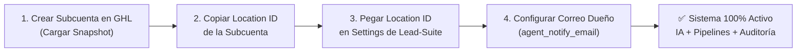

# 📦 Guía Maestra: Creación de Snapshot en Limpio para GoHighLevel (GHL)
**Para replicar el CRM Agéntico en todas tus Subcuentas de Agencia**

---

## 🎯 Objetivo de esta Guía
Empaquetar la subcuenta **`Ventas Art`** (o subcuenta plantilla) con toda la estructura que requiere el Agente de IA (Pipelines, Etapas, Etiquetas, Calendarios normalizados y Workflows automáticos) en un **Agency Snapshot**.

Cada vez que tengas un nuevo cliente o sucursal, clonas este Snapshot y el sistema queda 100% operativo en **menos de 2 minutos**.

---

## 🏗️ Fase 1: Subcuenta Fuente del Snapshot

> **⭐ Nota de Oro:** La subcuenta activa **`Ventas Art`** es la cuenta maestra de referencia. Todo lo que esté configurado en ella se convertirá directamente en tu Snapshot de agencia para no tener que empezar desde cero.

En **Settings $\rightarrow$ Business Profile**:
- **Timezone:** `America/Mexico_City`
- **Currency:** `MXN` (o `USD`)

---

## 📊 Fase 2: Configurar el Pipeline y Etapas

Ve a **Opportunities / Settings $\rightarrow$ Pipelines $\rightarrow$ Create / Edit Pipeline**.

* **Nombre del Pipeline:** `Pipeline de Ventas IA`
* **Las 6 Etapas (Stages) en este orden exacto:**

| # | Nombre de la Etapa | Qué hace el Agente aquí |
|---|---|---|
| 1 | **Contacto Inicial / Nuevo Lead** | Punto de entrada del prospecto al enviar su primer mensaje. |
| 2 | **Calificado por IA** | El agente lo mueve solo cuando el lead confirma interés, zona o presupuesto. |
| 3 | **Cita Agendada** | El agente lo mueve en cuanto se pacta una cita presencial o videollamada. |
| 4 | **En Seguimiento / Negociación** | El prospecto ya asistió a la cita o pidió llamada de seguimiento posterior. |
| 5 | **Ganado / Cerrado** *(Status: Won)* | El agente registra la venta final y asienta el valor monetario (\$MXN). |
| 6 | **Perdido / Descartado** *(Status: Lost)* | Si el prospecto no califica, no tiene presupuesto o cancela. |

*Haz clic en **Save**.*

---

## 🏷️ Fase 3: Crear las Etiquetas (Tags)

Ve a **Settings $\rightarrow$ Tags $\rightarrow$ New Tag (+)** y verifica que existan las siguientes 6 etiquetas:

1. **`ia-calificado`** $\rightarrow$ Lead que cumplió los criterios de compra/renta.
2. **`llamada-solicitada`** $\rightarrow$ Lead que pidió llamada telefónica en horario específico.
3. **`cita-agendada`** $\rightarrow$ Lead con cita bloqueada en el calendario.
4. **`seguimiento-vespertino`** $\rightarrow$ Prospecto con preferencia de contacto en la tarde (14:00 - 19:00 hrs).
5. **`seguimiento-matutino`** $\rightarrow$ Prospecto con preferencia de contacto en la mañana (09:00 - 13:00 hrs).
6. **`cliente-cerrado`** $\rightarrow$ Venta completada.

---

## 📅 Fase 4: Calendario Principal de Ventas

Ve a **Calendars $\rightarrow$ Calendar Settings $\rightarrow$ Create / Edit Calendar**.

### 1. Parámetros Principales
* **Nombre Exacto:** `Citas y Recorridos - Agente IA`
* **Slug URL:** `citas-ventas-ia`
* **Tipo:** *Simple Calendar* o *Round Robin*
* **Duración de la Cita:** `45 minutos`
* **Intervalo de Horarios:** `15 minutos`
* **Buffer Time (Tiempo de amortiguamiento):** `15 minutos`
* **Disponibilidad:** Lunes a Sábado de 09:00 a 19:00 hrs.
* **Auto-confirmación:** `Activada` (*Confirmed*).
* **Location:** *Google Meet* o dirección de la sucursal.

---

## ⚡ Fase 5: Workflows y Acciones Detalladas

Ve a **Automation $\rightarrow$ Workflows**:

---

### Workflow 1: `[Agente] Recordatorio Inteligente de Cita`
* **Trigger:** *Appointment Status $\rightarrow$ Confirmed* en calendario `Citas y Recorridos - Agente IA`.
* **Secuencia de Acciones:**
  1. **Email al Cliente (Inmediato):** Confirmación con liga de Google Meet/ubicación.
  2. **Notificación Push al Asesor (Inmediato):** Alerta en la app LeadConnector con teléfono y datos.
  3. **Wait Step 1:** Esperar hasta **24 horas antes** de la cita $\rightarrow$ Email/SMS de recordatorio al cliente.
  4. **Wait Step 2:** Esperar hasta **1 hora antes** de la cita $\rightarrow$ SMS/WhatsApp recordatorio final.

---

### Workflow 2: `[Agente] Notificar Tarea Asignada al Vendedor`
* **Trigger:** *Task Added*.
* **Secuencia de Acciones:**
  1. **Notificación Push al Asesor:** Alerta sonora: *«Nueva tarea del Agente IA para {{contact.name}}»*.
  2. **Email al Asesor:** Correo con instrucciones y recordatorio de completarla para evitar auditorías.

---

### Workflow 3: `[Agente] Cierre de Trato y Auditoría de Venta`
* **Trigger:** *Opportunity Status Changed $\rightarrow$ Won* en `Pipeline de Ventas IA`.
* **Secuencia de Acciones:**
  1. **Tag:** Agregar `cliente-cerrado`.
  2. **Email al Dueño/Gerente:** Correo de felicitación con el monto exacto (\$MXN) cobrado y el nombre del asesor responsable.

---

## 💾 Fase 6: Cómo Crear el Agency Snapshot desde "Ventas Art"

1. Ve a la vista de **Agencia (Agency View)** en GoHighLevel.
2. Ve a **Settings $\rightarrow$ Account Snapshots**.
3. Haz clic en **Create New Snapshot (+)**.
4. **Nombre del Snapshot:** `Snapshot CRM Agéntico 2026`
5. **Select Account:** Selecciona la subcuenta **`Ventas Art`**.
6. Selecciona los componentes a incluir:
   - ✅ **Pipelines & Stages** (`Pipeline de Ventas IA`)
   - ✅ **Tags** (Las 6 etiquetas estándar)
   - ✅ **Calendars** (`Citas y Recorridos - Agente IA`)
   - ✅ **Workflows** (Los 3 workflows configurados)
   - ✅ **Email Templates**
7. Haz clic en **Save**.

---

## 🚀 Fase 7: Despliegue en una Nueva Subcuenta (Checklist de 2 Minutos)

1. **En GoHighLevel:**
   - Crea la nueva subcuenta seleccionando `Snapshot CRM Agéntico 2026`.
   - Copia el **Location ID** desde *Settings $\rightarrow$ Business Profile*.
2. **En tu Aplicación Lead-Suite:**
   - Guarda el `Location ID` y el correo del dueño/gerente en la subcuenta.

**¡Todo listo! Ambas plataformas quedan 100% engranadas.**
